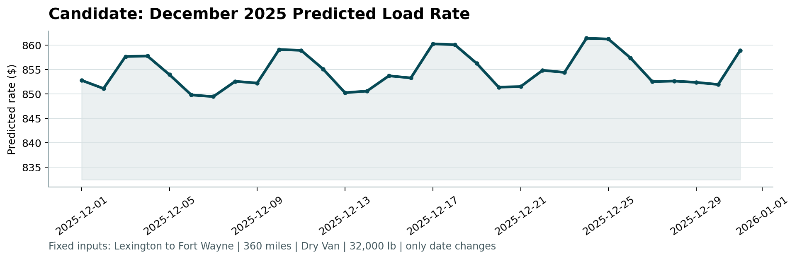

# Freight Rate Prediction

Take-home assessment for Spotter AI. Goal: predict `posted_rate` for 12k unseen freight loads.

Ended up being more interesting than expected — Ridge Regression beat both gradient boosting models once I log-transformed the target. Made sense in hindsight since log(rate) is basically linear in log(distance) + market signals.

## Numbers

- Ensemble MAE: **$112.87**
- MAPE: **5.20%**
- Best single model: Ridge ($124.68 MAE) — both LGB and XGB were worse

## What I tried

Started with EDA, found distance dominates (r=0.91 with rate). Cleaned up ~670 missing values across weight and market_index. Had ~240 extreme outliers in the target (one load at $25k) that I capped before training.

Ran 5-fold time-series CV comparing Ridge, LightGBM, and XGBoost — can't do random splits here since you'd end up training on future data. Ridge won every time once the target was log-transformed.

Final model is a weighted blend: 40% Ridge + 35% LGB + 25% XGB.

## CV results

| Model | Jun | Jul | Aug | Sep | Oct | Avg MAE |
|---|---|---|---|---|---|---|
| Ridge | $156 | $111 | $100 | $140 | $117 | **$124.68** |
| LightGBM | $179 | $123 | $127 | $138 | $127 | $138.94 |
| XGBoost | $202 | $131 | $137 | $135 | $136 | $148.34 |

## December chart



Fixed route: Lexington, KY -> Fort Wayne, IN | 360 mi | Dry Van | 32k lb

Market signals aren't available for December so I extrapolated a linear trend from the Jan-Oct data + added a day-of-week adjustment.

## Running it

```bash
pip install -r requirements.txt
python train_and_predict.py

# validate and generate the chart
python score.py --predictions validation_predictions.csv --december-predictions december-chart-inputs.csv
```

## Files

```
train_and_predict.py         main pipeline
score.py                     scorer (provided)
requirements.txt
validation_predictions.csv   12k predictions
december-chart-inputs.csv    dec predictions
scorer_results/
  candidate_december.png
```

## Data files (not in repo — provided separately)

`train-test.csv`, `validation.csv`, `validation-predictions-template.csv`, `december-chart-inputs.csv` — drop these in the project root before running.
